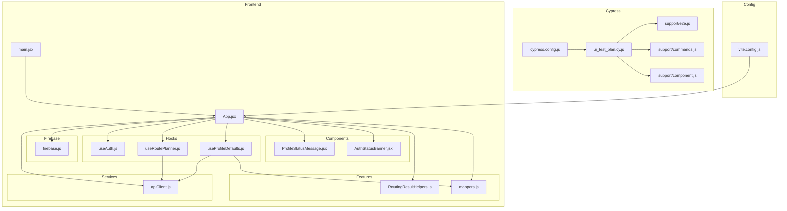

    

    <b>Automatic Architecture Diagrams from Code</b> 
    <a href="https://github.com/JashanMaan28/swark-continued">GitHub (Fork)</a> • <a href="https://github.com/swark-io/swark">Original Project</a>

## Usage Instructions

1. **Render the Diagram**: Use the links below to open it in Mermaid Live Editor, or install the [Mermaid Support](https://marketplace.visualstudio.com/items?itemName=bierner.markdown-mermaid) extension.
2. **Recommended Model**: If available for you, use `gemini` [language model](vscode://settings/swark-continued.languageModel). It can process more files and generates better diagrams.
3. **Iterate for Best Results**: Language models are non-deterministic. Generate the diagram multiple times and choose the best result.

## Generated Content
**Model**: GPT-4o - [Change Model](vscode://settings/swark-continued.languageModel)  
**Mermaid Live Editor**: [View](https://mermaid.live/view#pako:eNqNVE1P4zAQ_SuRz9CVOPaAxLasuFRCFPaSrJBJJql3E9vyB6JC_Pcdx3bspFBxaD1v5o1nxn7OO6lFA2RNKt4pKg_F47biRaHti4e_lOAGeOOcRXEjZYm_1V_99sd7dpTxcsC_zDcl70G9shq0d7t0tukZcFPSaGFayJqKpNpMwQvVENMj3gjesq5sAzy3xZ0Q_6byTxpurDmU1q8pbww9CGvgvqecg3KUHC-o90q0rIcttNT2Rjv2wnWup40YpOA4-9RYSN4baqwuZ2gHWtMOstPFY8TmAzeZP2Ojb1-fJyBRpetwEzLe3UEvQekywAfQOEFw5oPvqBx5g19PRhyXmXg2R4nlQr0AwuXVHq3qEaa9bq9uH0G7M2XPBo1niTewqo-JsbdSCmWQWGpv_oArOInjKQ-UN3oi1cHxGdPfR071nsj9ZLSxb7_Pb2aiJl_RXMw05bqnUlxeXrtX5DAuAYa3kDvnWs8jQcULV67WRWghzTw6k9qsp0lXuXcumDwStOFci2ZORzxt6ducrMxMTmMwSsdFoz0GkmK-CkWxnIl7QThCuu50m-SCDKDwO9jgp_S9IuYAA1RkXVSk8QNU5ANJVjbUwJZRVNFA1kZZuCDUGrE_8jpiJWx3IOuW9ho-_gPZZO91) | [Edit](https://mermaid.live/edit#pako:eNqNVE1P4zAQ_SuRz9CVOPaAxLasuFRCFPaSrJBJJql3E9vyB6JC_Pcdx3bspFBxaD1v5o1nxn7OO6lFA2RNKt4pKg_F47biRaHti4e_lOAGeOOcRXEjZYm_1V_99sd7dpTxcsC_zDcl70G9shq0d7t0tukZcFPSaGFayJqKpNpMwQvVENMj3gjesq5sAzy3xZ0Q_6byTxpurDmU1q8pbww9CGvgvqecg3KUHC-o90q0rIcttNT2Rjv2wnWup40YpOA4-9RYSN4baqwuZ2gHWtMOstPFY8TmAzeZP2Ojb1-fJyBRpetwEzLe3UEvQekywAfQOEFw5oPvqBx5g19PRhyXmXg2R4nlQr0AwuXVHq3qEaa9bq9uH0G7M2XPBo1niTewqo-JsbdSCmWQWGpv_oArOInjKQ-UN3oi1cHxGdPfR071nsj9ZLSxb7_Pb2aiJl_RXMw05bqnUlxeXrtX5DAuAYa3kDvnWs8jQcULV67WRWghzTw6k9qsp0lXuXcumDwStOFci2ZORzxt6ducrMxMTmMwSsdFoz0GkmK-CkWxnIl7QThCuu50m-SCDKDwO9jgp_S9IuYAA1RkXVSk8QNU5ANJVjbUwJZRVNFA1kZZuCDUGrE_8jpiJWx3IOuW9ho-_gPZZO91)

